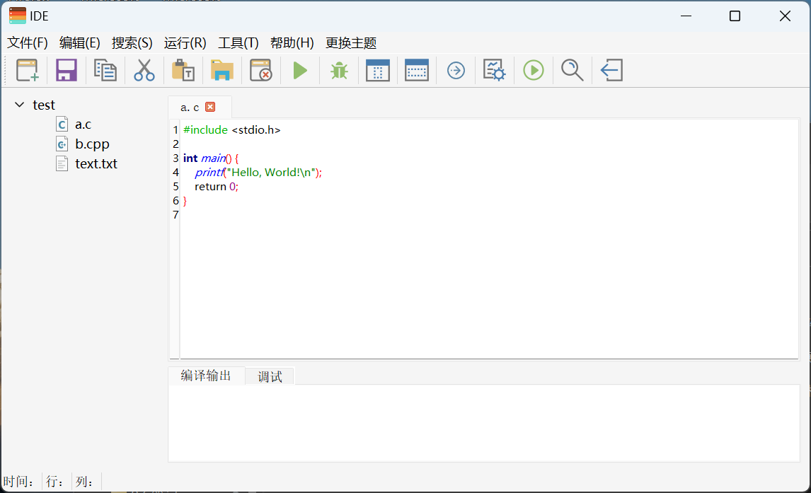

# C Language IDE Development

## Project Duration: August 2022 -- September 2022

## Introduction
This project involved the development of a C language Integrated Development Environment (IDE) using the Qt framework. As a team member, my role was to contribute to various aspects of the project. The goal was to create a feature-rich IDE that would assist programmers in writing and managing C code efficiently.

## Environment

- QT 5.9

## Key Contributions

During the development of the C Language IDE, I made the following contributions:

- Developed a C language IDE using the Qt framework, providing an intuitive and user-friendly environment for programmers to write, compile, and debug C code.
- Implemented essential IDE functionalities such as file management, code editing, and page zooming, enabling users to efficiently organize and navigate their projects.
- Worked on the design of the IDE pages, ensuring a visually appealing and ergonomic layout that enhances the coding experience.

## Screenshots

## Conclusion
The C Language IDE Development project aimed to create a powerful and user-friendly development environment for C programmers. By leveraging the Qt framework, we successfully developed a feature-rich IDE with essential functionalities such as file management, code editing, and page zooming. With the C Language IDE, programmers can streamline their coding workflow and enhance productivity. We invite you to explore the repository and experience the capabilities of our C Language IDE.
